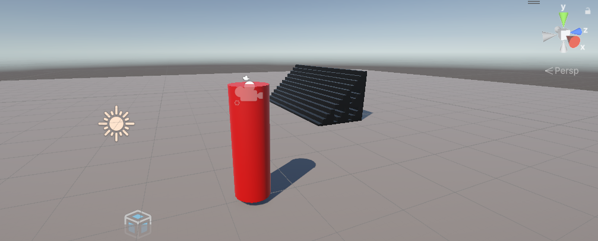

[![Contributors][contributors-shield]][contributors-url]
[![Forks][forks-shield]][forks-url]
[![Stargazers][stars-shield]][stars-url]
[![Issues][issues-shield]][issues-url]
[![Unlicense License][license-shield]][license-url]
[![LinkedIn][linkedin-shield]][linkedin-url]

  <h1>First Person Controller (Unity 6)</h1>
  
  

    A beginner-friendly 3D character controller project built in Unity 6, featuring smooth mouse-looking and physics-based movement.
  
 

  
  
  
    
    

  <a href="#about-the-project"><strong>Explore the docs »</strong></a>

  
Table of Contents

  <ol>
    <li><a href="#about-the-project">About The Project</a></li>
    <li><a href="#built-with">Built With</a></li>
    <li><a href="#file-structure">File Structure</a></li>
    <li><a href="#getting-started">Getting Started</a></li>
    <li><a href="#usage">Usage & Testing</a></li>
    <li><a href="#roadmap">Roadmap</a></li>
    <li><a href="#challenges">Challenges</a></li>
    <li><a href="#acknowledgement">Acknowledgement</a></li>
  </ol>

<h2 id="about-the-project">About The Project</h2>

    This project is a fundamental implementation of a <strong>First Person Controller</strong>. Built using Unity 6, it serves as a template for understanding how to separate camera rotation (head) from body movement.

Key learning objectives included:

<ul>
    <li>Setting up a <strong>Universal Render Pipeline (URP)</strong> project for modern lighting.</li>
    <li>Implementing a dual-script system: one for mouse look-around and one for physical movement.</li>
    <li>Using the <strong>CharacterController</strong> component for robust collision and movement handling.</li>
    <li>Managing parent-child object hierarchies to allow independent rotation.</li>
</ul>

<a href="#readme-top">↑ Back to Top</a>

<h2 id="built-with">Built With</h2>
<ul>
    <li><strong>Unity 6 (3D/URP):</strong> Utilized for modern lighting and the updated CharacterController component.</li>
    <li><strong>C#:</strong> Used to script the <code>MouseLook</code> and <code>PlayerMovement</code> logic.</li>
    <li><strong>Unity Physics:</strong> Employs <code>Physics.CheckSphere</code> for precise ground detection.</li>
    <li><strong>Legacy Input System:</strong> Uses <code>Input.GetAxis</code> for accessible, beginner-friendly control mapping.</li>
</ul>

<a href="#readme-top">↑ Back to Top</a>

<h2 id="file-structure">File Structure</h2>
<pre>fpc-test/
├── .vs/                            # Visual Studio configuration files
├── Assets/                         # Core game assets
│   ├── Materials/                  # Materials and shaders for URP
│   ├── Scenes/                     # Unity scene files
│   ├── Scripts/                    # C# gameplay scripts
│   │   ├── MouseLook.cs            # Handles camera and body rotation
│   │   └── PlayerMovement.cs       # Handles walking, gravity, and jumping
│   ├── Settings/                   # URP and project-specific settings
│   ├── TutorialInfo/               # Tutorial metadata and resources
│   ├── InputSystem_Actions.inputactions # Input system configuration
│   └── Readme.asset                # Internal Unity asset documentation
├── Library/                        # Unity cache (auto-generated)
├── Logs/                           # Editor and console logs
├── obj/                            # Intermediate build files
├── Packages/                       # Unity package dependencies
├── ProjectSettings/                # Global project configuration
├── UserSettings/                   # Local user-specific settings
├── .gitattributes                  # Git LFS and attribute settings
├── .gitignore                      # Defines files to ignore in version control
├── .vsconfig                       # Visual Studio environment settings
├── Assembly-CSharp-Editor.csproj   # Editor-specific C# project file
├── Assembly-CSharp.csproj          # Main gameplay C# project file
├── README.md                       # Main project documentation in Markdown
└── Test FMC.sln                    # Visual Studio Solution file
</pre>

<a href="#readme-top">↑ Back to Top</a>

<h2 id="getting-started">Getting Started</h2>
<h3>Prerequisites</h3>
<ul>
    <li><strong>Unity Hub</strong> </li>
    <li><strong>Unity 6</strong> (specifically for URP and updated CharacterController) </li>
</ul>
<h3>Installation</h3>
<ol>
    <li>Create a new 3D (URP) project in Unity Hub</li>
    <li>Create a <strong>Plane</strong> scaled to (10, 1, 10) for the ground.</li>
    <li>Create a <strong>Capsule</strong> named "Player" at position (0, 1, 0).</li>
    <li>Attach a <strong>CharacterController</strong> to the Player.</li>
    <li>Create a "CameraHolder" empty object inside the Player to house the Main Camera.</li>
</ol>

<a href="#readme-top">↑ Back to Top</a>

<h2 id="usage">Usage & Testing</h2>
<h3>🎮 Controls</h3>
<ul>
    <li><strong>Mouse:</strong> Look around (Horizontal rotates body, Vertical rotates camera).</li>
    <li><strong>W/A/S/D:</strong> Move the character.</li>
    <li><strong>Space:</strong> Jump.</li>
</ul>

Watch the sample gameplay at my linkedIn post here: <a href="https://www.linkedin.com/posts/activity-7419597235161735168-N75n?utm_source=share&utm_medium=member_desktop&rcm=ACoAAC64xbIBQ-4tMrEhn1BXRr8SmkzqiMPX0k8">First Person Controller Testing</a>

<h3>Testing Focus</h3>
<ul>
    <li><strong>Grounding:</strong> Verifying the <code>GroundCheck</code> object correctly resets vertical velocity.</li>
    <li><strong>Clamping:</strong> Ensuring the vertical look rotation is clamped between -80 and 80 degrees to prevent flipping.</li>
    <li><strong>Scale:</strong> Ensuring movement speed remains consistent using <code>Time.deltaTime</code>.</li>
</ul>

<a href="#readme-top">↑ Back to Top</a>

<h2 id="roadmap">Roadmap</h2>
<ul>
    <li>[x] Basic Mouse Look with vertical clamping </li>
    <li>[x] CharacterController-based movement </li>
    <li>[x] Ground detection and Jumping physics </li>
    <li>[ ] Transition to the New Input System </li>
    <li>[ ] Replace standard UI with TextMeshPro </li>
    <li>[ ] Implement Sprinting and Crouching mechanics</li>
</ul>

<a href="#readme-top">↑ Back to Top</a>

<h2 id="challenges">Challenges</h2>
<table width="100%">
    <thead>
        <tr>
            <th>Challenge</th>
            <th>Solution</th>
        </tr>
    </thead>
    <tbody>
        <tr>
            <td><strong>Disjointed Rotation</strong></td>
            <td>Used a <code>CameraHolder</code> transform to separate vertical head tilt from horizontal body rotation.</td>
        </tr>
        <tr>
            <td><strong>Unity 6 Lighting</strong></td>
            <td>Adjusted HDR intensity because the new lighting engine requires higher values than older versions.</td>
        </tr>
        <tr>
            <td><strong>Infinite Falling</strong></td>
            <td>Implemented a <code>GroundCheck</code> sphere to apply a small constant downward force when grounded, preventing gravity accumulation.</td>
        </tr>
    </tbody>
</table>

<a href="#readme-top">↑ Back to Top</a>

<h2 id="acknowledgement">🙏 Acknowledgements</h2>

Special thanks to <strong><a href="https://www.youtube.com/@Brackeys">Brackeys</a></strong> for the legendary Unity tutorials that continue to help beginners enter game development.

View the tutorial here: <a href="https://www.youtube.com/watch?v=_QajrabyTJc">FIRST PERSON MOVEMENT in Unity - FPS Controller</a>

This repository is intended for learning and portfolio showcase purposes only.

<a href="#readme-top">↑ Back to Top</a>

[contributors-shield]: https://img.shields.io/github/contributors/ShenLoong99/fpc-test.svg?style=for-the-badge
[contributors-url]: https://github.com/ShenLoong99/fpc-test/graphs/contributors
[forks-shield]: https://img.shields.io/github/forks/ShenLoong99/fpc-test.svg?style=for-the-badge
[forks-url]: https://github.com/ShenLoong99/fpc-test/network/members
[stars-shield]: https://img.shields.io/github/stars/ShenLoong99/fpc-test.svg?style=for-the-badge
[stars-url]: https://github.com/ShenLoong99/fpc-test/stargazers
[issues-shield]: https://img.shields.io/github/issues/ShenLoong99/fpc-test.svg?style=for-the-badge
[issues-url]: https://github.com/ShenLoong99/fpc-test/issues
[license-shield]: https://img.shields.io/github/license/ShenLoong99/fpc-test.svg?style=for-the-badge
[license-url]: https://github.com/ShenLoong99/fpc-test/blob/master/LICENSE.txt
[linkedin-shield]: https://img.shields.io/badge/-LinkedIn-black.svg?style=for-the-badge&logo=linkedin&colorB=555
[linkedin-url]: https://linkedin.com/in/si-kai-tan